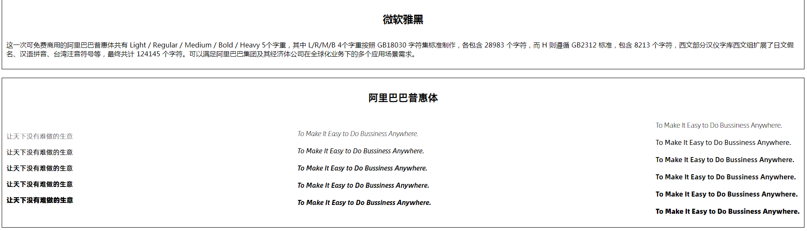

## alibaba-puhuiti
> 在UCAN 2019 设计大会上，阿里巴巴设计率先向全社会发布了一款字体“阿里巴巴普惠体”，希望能够让阿里巴巴的普惠精神，让整个生态的设计师、合作伙伴因为我们平台的赋能，真正得到实惠。

> 这一次可免费商用的阿里巴巴普惠体共收录 116,895 个全形汉字（含 5 个字重），西文 Alibaba Sans 共 7,205 个拉丁字母（2 种风格、共 11 个字重），覆盖 172 个语种（覆盖大部分欧语国家），并可以满足阿里巴巴集团及其经济体公司在全球化业务下的多个应用场景需求。

本项目是阿里巴巴普惠体在前端开发中的实际应用。

## Demo
[Demo](https://liruifengv.github.io/alibaba-puhuiti/index.html)

## 截图

## 阿里巴巴普惠体下载链接

[下载](https://ics.alibaba.com/project/Hn8mXx)
